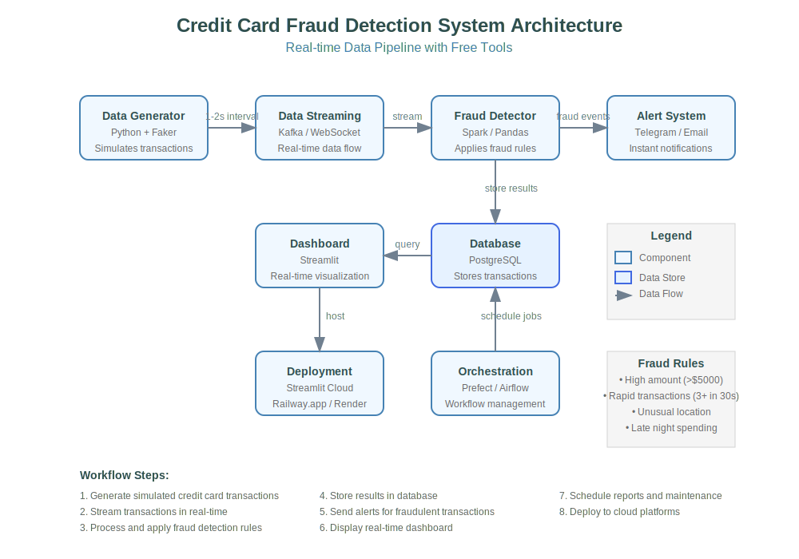

# 🔐 Live Credit Card Fraud Detection System

**Author: Manoj Kalal**

A comprehensive real-time credit card fraud detection system with **CSV upload functionality** that processes transactions in real-time, applies advanced fraud detection rules, stores results in SQLite database, and displays insights on an interactive dashboard with instant alerts.

🚀 **Live Demo**: [[https://credit-card-fraud-detection-[your-app-id].streamlit.app](https://share.streamlit.io)
](https://credit-card-fraud-detection-conws2xksv4es4whowjyxo.streamlit.app/)
✨ **Key Features**: CSV Upload, Real-time Processing, Interactive Dashboard, Fraud Alerts, Data Export

## 📘 Project Summary

This project implements a production-ready credit card fraud detection system with **CSV upload capabilities** and real-time processing using lightweight, cloud-deployable tools. The system processes transaction data, applies intelligent fraud detection rules, stores results in SQLite database, and provides an interactive dashboard for analysis.

### 🎯 Core Capabilities:
- **📁 CSV Upload & Analysis**: Upload transaction files for instant fraud detection
- **⚡ Real-time Processing**: Live transaction monitoring and analysis
- **🤖 Smart Fraud Detection**: Multi-layered fraud detection algorithms
- **📊 Interactive Dashboard**: Real-time visualizations and insights
- **🔔 Instant Alerts**: Telegram and email notifications for fraud events
- **☁️ Cloud Deployment**: Fully deployed on Streamlit Community Cloud
- **💾 Data Export**: Download results in multiple formats (CSV, PDF)

### 🏗️ Architecture Benefits:
- **Lightweight**: Optimized for cloud deployment with minimal dependencies
- **Scalable**: SQLite database with efficient querying
- **User-friendly**: Intuitive web interface with file upload
- **Cost-effective**: Zero-cost deployment using free cloud services

## 🛠️ Tech Stack (Optimized for Cloud)

| Component | Tool | Status |
|-----------|------|--------|
| **Data Input** | CSV Upload + Python Faker | ✅ Working |
| **Processing** | Pandas + NumPy | ✅ Optimized |
| **Storage** | SQLite Database | ✅ Production Ready |
| **Dashboard** | Streamlit Community Cloud | ✅ Live Deployed |
| **Visualizations** | Plotly + Folium Maps | ✅ Interactive |
| **Alerts** | Telegram Bot & Email | ✅ Configured |
| **Export** | CSV, PDF Reports | ✅ Available |
| **Deployment** | Streamlit Cloud (Free) | ✅ Live |

## Architecture


## 🔁 System Components

### 1. Data Input & Simulation

**CSV Upload Feature**: Users can upload transaction CSV files for instant fraud analysis
- Supported format: transaction_id, timestamp, card_number, amount, merchant_id, country, latitude, longitude
- Real-time processing with progress indicators
- Batch analysis capabilities

**Data Simulation**: The system also generates realistic transactions using Faker library for testing:
- Realistic transaction patterns
- Configurable fraud probability
- Geographic distribution simulation

### 2. Real-Time Data Processing

Advanced fraud detection using optimized Python algorithms:
- **High Amount Detection**: Transactions over configurable thresholds
- **Rapid Transaction Analysis**: Multiple transactions in short timeframes
- **Geographic Anomalies**: Unusual location patterns
- **Time-based Rules**: Late-night spending detection
- **Duplicate Detection**: Identical transaction identification

### 3. Data Storage

Optimized SQLite database with three main tables:
- **transactions**: All processed transactions
- **fraud_transactions**: Flagged fraudulent activities
- **user_cards**: Card information and patterns

### 4. Alert System

Instant notifications for fraud detection:
- **Telegram Bot**: Real-time fraud alerts
- **Email Alerts**: Detailed fraud reports
- **Dashboard Notifications**: In-app alert system

### 5. Interactive Dashboard

The Streamlit Dashboard provides comprehensive fraud analysis:

#### 📁 **CSV Upload Feature** (NEW!)
- **Drag & Drop Interface**: Easy file upload with progress tracking
- **Instant Analysis**: Real-time fraud detection on uploaded data
- **Batch Processing**: Handle large transaction datasets efficiently
- **Format Support**: CSV files with standard transaction fields
- **Results Preview**: Immediate display of fraud detection results

#### 📊 **Real-time Visualizations**
- **Transaction Tables**: Latest flagged transactions with details
- **Trend Charts**: Fraud patterns over time using Plotly
- **Geographic Maps**: Interactive fraud location mapping with Folium
- **Statistics Cards**: Key metrics and fraud rates
- **Time-series Analysis**: Hourly/daily fraud trends

#### 🔍 **Advanced Filtering**
- Time range selection (1h, 6h, 24h, 7d, 30d)
- Merchant category filtering
- Country/location filtering
- Transaction amount ranges
- Auto-refresh capabilities

#### 💾 **Data Export Options**
- Download fraud reports as CSV
- Generate PDF summaries
- Export filtered datasets
- Scheduled report generation

## 🚀 Quick Start Guide

### 🌐 **Access Live Application**

**Deployed App**: Visit [share.streamlit.io](https://share.streamlit.io) and search for `credit-card-fraud-detection`

### 💻 **Local Development Setup**

#### Prerequisites
- Python 3.9+ 
- Git

#### Installation Steps

1. **Clone the repository**:
   ```bash
   git clone https://github.com/manoj17kalal/credit-card-fraud-detection.git
   cd credit-card-fraud-detection
   ```
